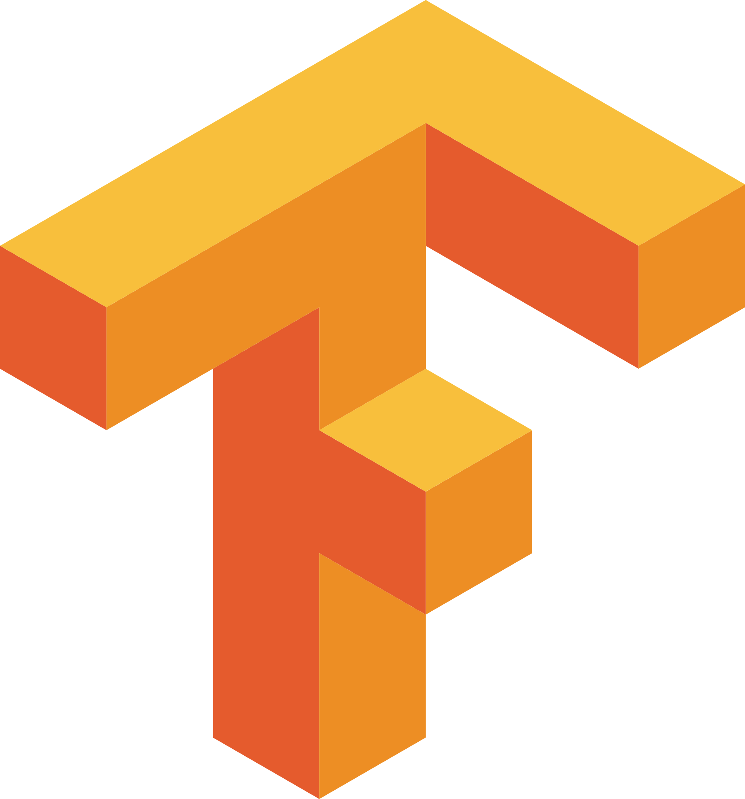
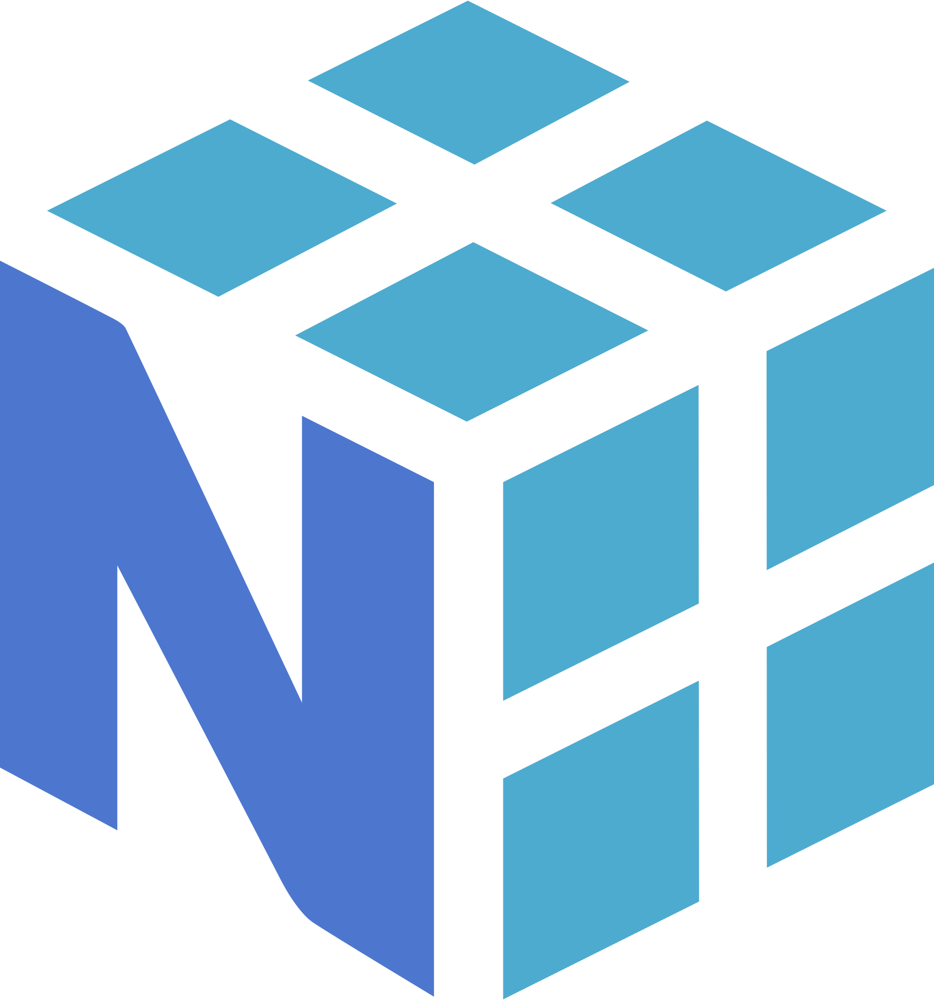
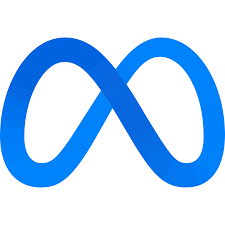
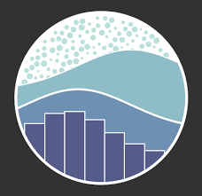

<h1 align="center">
  
</h1>

<h5 align="center">
  <code><a href="https://www.linkedin.com/in/kunalmishravit" title="LinkedIn Profile"> LinkedIn</a></code>
  <code><a href="https://leetcode.com/user5214rS" title="LeetCode Profile"> LeetCode</a></code>
  <code><a href="https://www.geeksforgeeks.org/user/kunalmisr1hy" title="GFG Profile"> GFG</a></code>
  <code><a href="https://www.instagram.com/ku_____l" title="Instagram Profile"> Instagram</a></code>
  <code><a href="https://x.com/KunalMishr66306" title="X Profile"> X</a></code>
</h5>

 

  Hi, I’m Kunal Mishra — an aspiring Data Scientist, ML Engineer & AI Researcher from India
    
  🎓 I’m currently pursuing an Integrated M.Tech in CSE (Computational & Data Science) at Vellore Institute of Technology
   
  🤖 Passionate about Artificial Intelligence, Machine Learning & Deep Learning, with a focus on NLP, Generative AI & Agentic AI systems  
   
  🧠 Actively exploring Advanced DSA, LLM architectures & cutting-edge AI applications  
   
  🎯 In my free time, I love solving coding puzzles, participating in hackathons & playing chess  
   
  🛠 Got a question or suggestion? Let’s talk <a href="https://github.com/kunalmishravitb/kunalmishravitb/issues" title="Issues">here</a>  
   
  📫 Or connect with me: <a href="mailto:kunalmishra.vitb@gmail.com">kunalmishra.vitb@gmail.com</a>  

<h2 align="center">🧠 Skills & Technologies</h2>

<h3 align="center">💻 Programming Languages</h3>

  <code></code>
  <code></code>
  <code></code>
  <code></code>
  <code></code>
  <code></code>
  <code></code>

<h3 align="center">🤖 AI / ML / Data Science</h3>

  <code></code>
  <code></code>
  <code></code>
  <code></code>
  <code></code>
  <code></code>
  <code></code>
  <code></code>
  <code></code>
  <code></code>
  <code></code>

<h3 align="center">🖥️ Frontend Development</h3>

  <code></code>
  <code></code>
  <code></code>
  <code></code>
  <code></code>
  <code></code>

<h3 align="center">⚙️ Backend Development</h3>

  <code></code>
  <code></code>
  <code></code>
  <code></code>

<h3 align="center">🗄️ Databases</h3>

  <code></code>
  <code></code>
  <code></code>
  <code></code>
  <code></code>

<h3 align="center">📊 Data Visualization & App Tools</h3>

  <code></code>
  <code></code>
  <code></code>
  <code></code>
  <code></code>

<h3 align="center">🚀 DevOps & Tools</h3>

  <code></code>
  <code></code>
  <code></code>
  <code></code>
  <code></code>

<h2 align="center">⚡ Stats ⚡</h2>
 

  

    
    
  

           
  

    
  

   

  

<h2 align="center">👨‍💻 Repositories 👨‍💻</h2>
 

  

      

  
  

      

  
  

      

<h4 align="center">
  <a href="https://github.com/kunalmishravitb?tab=repositories" title="Show Repositories">🔎 Show More 🔍</a>
</h4>

